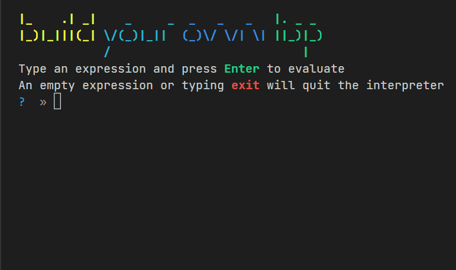

# Build your own Lisp

[ [get started here](./workshop/001%20-%20A%20Lisp%20Calculator.md) ]

## What is this?

This is a short (1h-1.5h) workshop about building a small Lisp Interpreter.

## What do I need?

- [Node.js LTS](https://nodejs.org/en/) (v14+)
- [VS Code](https://code.visualstudio.com/)

## What will be the end result?

## How to start / test the code

- Run `npm run start` to start an interactive Read Evaluate Print loop
- Run `npm run test` to run a test watcher

## References used

- [Little Lisp interpreter](https://maryrosecook.com/blog/post/little-lisp-interpreter) by Mary Rose Cook
- [(How to Write a (Lisp) Interpreter (in Python))](https://norvig.com/lispy.html) by Peter Norvig
- [How to Write a Lisp Interpreter in JavaScript](https://chidiwilliams.com/post/how-to-write-a-lisp-interpreter-in-javascript/) by Chidi Williams
- [Crafting Interpreters](https://craftinginterpreters.com/contents.html) by Robert Nystrom (highly recommended for going deeper into this topic!)
